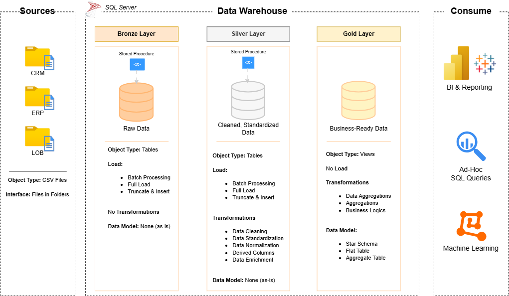

# Olist Data Warehouse Project
This project demonstrates the implementation of a data warehouse using the Olist E-commerce dataset, covering the end-to-end process from data ingestion, data cleaning and transformation, dimensional modeling, to the creation of analytical data marts.

_**Notes**_
Some business scenarios, assumptions, and transformations in this project have been intentionally adapted to better simulate real-world data warehousing practices. As this project is intended for portfolio purposes, certain business rules and derived attributes do not exist in the original Olist dataset and were created to reflect how similar requirements might be implemented in an actual business environment.

## Data Architecture
The data architecture for this project follows Medallion Architecture **Bronze**, **Silver** and **Gold** layers:

1. **Bronze Layer**: Stores raw data as-is from the source systems. Data is ingested from CSV Files into SQL Server Database.
2. **Silver Layer**: This layer includes data cleansing, standardization, and normaliztion processes to prepare for analysis.
3. **Gold Layer**: Houses business-ready data modeled into a star schema required for reporting and analytics.

## Project Overview
This project involves:
1. **Data Architecture:** Designing a Modern Data Warehouse using Medallion Architecture Bronze, Silver and Gold.
2. **ETL Pipeline:** Extracting, transforming, and loading data from source systems into the warehouse.
3. **Data Modelling:** Developing fact and dimension tables optimized for analytical queries.

## Project Requirements
#### Objective
Develop a modern data warehouse using SQL Server to consolidate sales data, enabling analytical reporting and informed decision-making.
#### Spesifications
- **Data Source:** Import data from three source systems (ERP, CRM and SCM) provided as CSV files.
- **Data Quality:** Cleans and resolve data quality issues prior to analysis.
- **Integration:** Combine three sources into a single, user-friendly data mmodel designed for analytical queries.
- **Scope:** Focus on the latest dataset only; historization of data is not required.
- **Documentation:** Provide clear documentation of the data model to support both business stakeholders and analytics teams.
